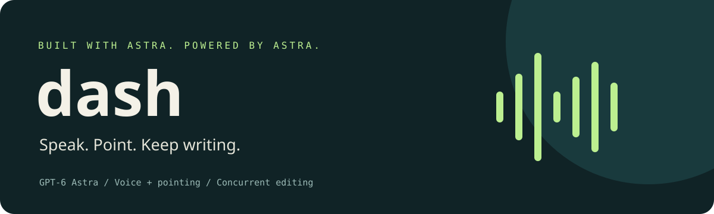

<p align="center"></p>

<p align="center">
  <strong>Built with GPT-6 Astra. Powered by GPT-6 Astra.</strong><br>
  Speak an edit. Point at what you mean. Keep typing while Astra works.
</p>

<p align="center">
  
  
  
  
</p>

## The idea

Most AI editors make you select text, write a prompt, and wait. Dash explores a more fluid interaction: talk and point while staying in the document.

> “Make this paragraph shorter. Turn these details into a list. Keep the delivery date I just changed.”

**GPT-6 Astra is the editing intelligence.** It interprets the spoken request together with timestamped selections, generates scoped proposals, and reconciles those proposals against the latest document. You can continue typing while the model works.

Built for the **GPT-6 Astra Hackathon SF**: a native, inspectable prototype of human–AI collaboration inside an editor.

### Astra built it. Astra runs it.

**In development:** the entire project was developed with GPT-6 Astra. We used it to prototype and iterate the GUI, refine complex prompts with latency and accuracy as goals, and exercise the interface through computer use to reduce manual testing. Astra helped us move through the design → implementation → test → refinement loop.

**In the product:** Astra understands complex, multimodal user intent expressed through speech, pointing, and text selection. It resolves references like “this paragraph” in context, generates and refines text, and reconciles those changes with your ongoing typing. The app converts speech into a transcript and word times, then sends those alongside timestamped pointer/selection events and document context to Astra.


## Where Astra does the work

| Stage | Astra’s role |
|---|---|
| **Understand “this”** | Combine the transcript, word times, document context, and pointer events to resolve what each request refers to. |
| **Work on several edits** | Generate independent proposals concurrently for the requested passages. |
| **Keep up with you** | Reconcile each proposal against newer typing and already-accepted edits. |
| **Make changes inspectable** | Return text and structured decisions; the app validates scope and revisions before applying changes and displaying before/after snippets. |

All three reasoning stages use **`gpt-6-astra` through the OpenAI Responses API**, with structured outputs for interpretation and reconciliation. The local scheduler coordinates concurrent requests; Automerge tracks document revisions and enforces commit boundaries.

A supporting speech service supplies transcription and timing. The core experiment is how Astra uses that context to collaborate with a person who is still editing. “Multimodal” describes the combined user interactions; this client passes their text/event representation to Astra, not raw microphone audio or screen pixels.

**Prototype status:** the native editor builds and offline checks run. The full microphone → speech service → Astra → final-edit flow has not been validated end to end. Model access and an OpenAI API key are required. See [the demo outline and contribution boundaries](docs/HACKATHON.md).

## Try it · Mac

Requires macOS 14+, Xcode, XcodeGen, Node 22+, and an OpenAI API key with GPT-6 Astra access.

```sh
brew install xcodegen node
npm ci --prefix Engine --ignore-scripts
cp .env.example .env.local
```

Add your `OPENAI_API_KEY` to `.env.local`, then:

```sh
./scripts/build.sh
python3 scripts/run.py
```

The launcher loads your local settings and starts the editing helper. Direct Xcode Run opens the editor but does not load `.env.local` or automatically start the helper. No credentials are bundled in the app.

1. Start the [supporting speech service](docs/SPEECH.md) and point `DASH_ASR_URL` at it.
2. Open some disposable sample text. Allow microphone access on first recording.
3. Press **Start recording**, speak a short instruction, and select what you mean.
4. Press **Stop recording**. Continue typing while Astra works, then inspect the resulting changes.

Use your Mac’s default microphone; choose a different input in System Settings → Sound. Keep recordings under two minutes. Without model services, Dash still opens and edits plain-text files and reports unavailable inference explicitly.

## Why this is an Astra project

The interesting behavior is contextual reference resolution and reconciliation with a changing document. A transcript alone does not tell an editor which “this” you meant, and a generated rewrite can be stale by the time it arrives. Dash gives Astra the interaction history and current document, then checks its proposed changes before committing them.

Today this uses independent Responses API calls and an application-managed scheduler. **Astra async tool calling and WebSocket mid-turn steering are future experiments, not implemented features.** See [the roadmap](docs/ROADMAP.md) for how those could extend this interaction.

## Build on it

| Area | Start here |
|---|---|
| Astra API integration | [`Engine/model_client.mjs`](Engine/model_client.mjs) |
| Interpreting speech + selections | [`Engine/hack6/interpret.txt`](Engine/hack6/interpret.txt) |
| Generation and reconciliation | [`Engine/hack8/`](Engine/hack8/) |
| Concurrent jobs and cancellation | [`Engine/scheduler.mjs`](Engine/scheduler.mjs) |
| Native editing and conversation UI | [`App/EditorView.swift`](App/EditorView.swift) |
| Microphone adapter | [`App/MicrophoneCaptureService.swift`](App/MicrophoneCaptureService.swift) |

[Architecture](docs/ARCHITECTURE.md) · [Demo & contribution notes](docs/HACKATHON.md) · [Contributing](CONTRIBUTING.md) · [Speech setup](docs/SPEECH.md)

## Data and limitations

Document text, transcripts, selections, and editing instructions are sent to OpenAI for Astra requests. Audio is sent to your configured speech service. Requests use `store: false`; this is an API setting, not a blanket data-retention guarantee. Refer to the [OpenAI data controls](https://developers.openai.com/api/docs/guides/your-data). API calls consume your credits.

The Mac retains recordings and full document revisions in `~/Library/Application Support/DashHackathon/`. Restart clears the UI, not saved files. Delete those directories yourself when finished, and review exports before sharing. Optional diagnostics also contain document/model content.

Input latency is approximate, and semantic interpretation can be wrong. There is no streaming speech, packaged Node helper, automatic server installer, or production/notarized distribution yet. Use sample text while experimenting.

## Checks

```sh
npm test --prefix Engine
swift test --package-path Packages/EditorInteractionKit
python3 -m unittest discover -s server -p 'test_*.py'
python3 scripts/check-public.py
```

CI builds the Mac app and runs offline checks. It does not call Astra, download speech models, or claim a live end-to-end test.

## License & credits

MIT. See [LICENSE](LICENSE) and [THIRD_PARTY_NOTICES.md](THIRD_PARTY_NOTICES.md).

Powered by [GPT-6 Astra](https://developers.openai.com/api/docs/models/gpt-6-astra), with [Automerge](https://automerge.org/) for document state. Speech dependencies and their setup are documented separately. Model weights are not included. This is a participant project, not an official OpenAI product.
