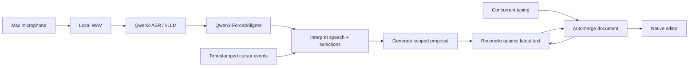

# How an edit travels

`App/` owns microphone permissions, capture, selection observation, and rendering. `server/` returns transcript plus word times. `Engine/` is a local Node process using a line-delimited request/reply protocol. It calls the configured vLLM text model and applies only proposals that satisfy its scope and revision checks. `Packages/EditorInteractionKit/` contains shared document and recording types.

Interpretation is semantic and can be wrong. Before committing a generated proposal, the engine checks its working area and latest document heads. Ambiguous/deleted selections and incompatible concurrent edits may fail instead of applying. Those checks reduce accidental damage; they do not guarantee that a model understood a request.

The app launches the Node helper with the current user's permissions. This development target is not sandboxed because the helper is external. Credentials are supplied at launch and never generated into app resources. ASR receives audio; the text model receives document content. Nothing in the normal flow requires a hosted company backend.
