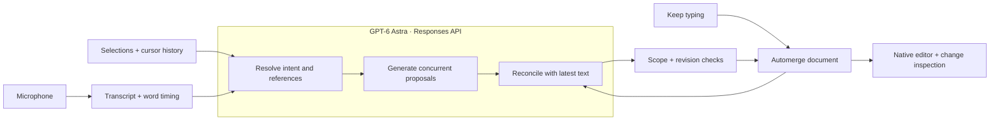

# Astra inside the editing loop

`Engine/model_client.mjs` sends all interpretation, generation, and reconciliation requests to GPT-6 Astra. Interpretation and reconciliation use structured outputs. Generation returns text. The client uses `reasoning.effort: low` by default; `DASH_REASONING_EFFORT` can select another supported effort.

`Engine/scheduler.mjs` runs independent generation jobs concurrently and serializes reconciliation. The application owns this scheduling; it does not yet use Astra’s async tool calling or WebSocket mid-turn steering. A new document revision can trigger another reconciliation attempt before the native poll commits the result.

`App/` owns recording, timestamped selection observation, native editing, and rendering. `Packages/EditorInteractionKit/` supplies shared document/capture types. `server/` is a supporting speech adapter described in [SPEECH.md](SPEECH.md).

Astra receives document context and resolved/captured interaction data. The application enforces working-area boundaries and current document heads. Ambiguous references or incompatible edits may fail visibly. These checks do not guarantee semantic correctness.

The Node helper runs with the user’s permissions. The development app is not sandboxed because the helper is external. Credentials are read at launch and never generated into app resources. Document and transcript content goes to OpenAI; audio goes to the configured speech service.
